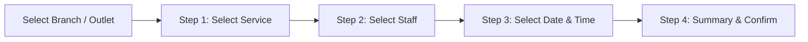

# Senang Member App — Complete User Manual & Feature Guide

Welcome to the **Senang Member App** User Manual! This guide provides detailed, step-by-step instructions for all features and capabilities of the Senang Member mobile and web application.

---

## 📋 Table of Contents

1. [Application Overview](#1-application-overview)
2. [Getting Started: Registration, Login & Security](#2-getting-started-registration-login--security)
   - 2.1 [New Member Registration (with Email OTP)](#21-new-member-registration-with-email-otp)
   - 2.2 [Member Sign In (with On-Screen Keypad)](#22-member-sign-in-with-on-screen-keypad)
   - 2.3 [Password Reset via WhatsApp OTP](#23-password-reset-via-whatsapp-otp)
   - 2.4 [Changing Your Password](#24-changing-your-password)
   - 2.5 [Account Deletion (Self-Service)](#25-account-deletion-self-service)
3. [Multi-Merchant & Company Selection](#3-multi-merchant--company-selection)
   - 3.1 [Selecting a Merchant Store](#31-selecting-a-merchant-store)
   - 3.2 [Quick-Switching Stores from the Dashboard](#32-quick-switching-stores-from-the-dashboard)
   - 3.3 [Store-Level Settings Modal](#33-store-level-settings-modal)
4. [Home Dashboard & Loyalty Balances](#4-home-dashboard--loyalty-balances)
   - 4.1 [Dashboard Header & Notifications](#41-dashboard-header--notifications)
   - 4.2 [Digital Balances: Credits, Points & Packages](#42-digital-balances-credits-points--packages)
   - 4.3 [Prepaid Credits Management](#43-prepaid-credits-management)
   - 4.4 [Loyalty Points & Rewards](#44-loyalty-points--rewards)
   - 4.5 [Service Packages & Session Tracking](#45-service-packages--session-tracking)
   - 4.6 [Upcoming Appointment Card & Quick Contact](#46-upcoming-appointment-card--quick-contact)
5. [Appointment Booking & Management](#5-appointment-booking--management)
   - 5.1 [Viewing Scheduled Appointments (1-Month vs. 1-Year)](#51-viewing-scheduled-appointments-1-month-vs-1-year)
   - 5.2 [Step-by-Step Booking Wizard](#52-step-by-step-booking-wizard)
     - *Step 0: Select Outlet / Branch*
     - *Step 1: Select Service(s) & View Details*
     - *Step 2: Select Specialist / Staff*
     - *Step 3: Choose Date & Time Slot*
     - *Step 4: Review Summary & Confirm Booking*
   - 5.3 [Appointment Details, Google Maps Navigation & Contact Actions](#53-appointment-details-google-maps-navigation--contact-actions)
6. [AI Administrative ChatBot Assistant](#6-ai-administrative-chatbot-assistant)
   - 6.1 [Launching the AI Assistant](#61-launching-the-ai-assistant)
   - 6.2 [Multilingual Text & Quick Replies](#62-multilingual-text--quick-replies)
   - 6.3 [Voice Message & Audio Input](#63-voice-message--audio-input)
   - 6.4 [Smart Booking, Rescheduling & Cancelling via Chat](#64-smart-booking-rescheduling--cancelling-via-chat)
7. [Catalog & Product Browsing](#7-catalog--product-browsing)
   - 7.1 [Browsing Categories](#71-browsing-categories)
   - 7.2 [Viewing Service & Product Listings](#72-viewing-service--product-listings)
   - 7.3 [Detailed Service Modals](#73-detailed-service-modals)
8. [Treatment & Purchase History](#8-treatment--purchase-history)
   - 8.1 [Viewing Service Records & Invoices](#81-viewing-service-records--invoices)
   - 8.2 [Filtering History by Month](#82-filtering-history-by-month)
   - 8.3 [Rating & Review System (Google Reviews & Private Feedback)](#83-rating--review-system-google-reviews--private-feedback)
9. [Announcements & Promotions](#9-announcements--promotions)
10. [Profile Settings & Localization](#10-profile-settings--localization)
    - 10.1 [Viewing & Editing Personal Profile](#101-viewing--editing-personal-profile)
    - 10.2 [Switching App Languages (English / 中文 / Bahasa Melayu)](#102-switching-app-languages-english--中文--bahasa-melayu)
    - 10.3 [Logging Out Securely](#103-logging-out-securely)
11. [Troubleshooting & Frequently Asked Questions (FAQ)](#11-troubleshooting--frequently-asked-questions-faq)

---

## 1. Application Overview

**Senang Member App** is an all-in-one customer membership, appointment booking, and loyalty portal designed for customers of salons, beauty clinics, spas, wellness centres, and retail outlets powered by the Senang ecosystem.

### Key Highlights:
- **Multi-Merchant Wallet**: Seamlessly switch between different affiliated stores and businesses with one user account.
- **Real-Time Booking**: Book, reschedule, and manage service appointments with specific specialists and time slots.
- **Loyalty & Balance Tracking**: View your prepaid cash credits, package balances, and reward points.
- **Smart AI Chat Assistant**: Interactive AI assistant supporting voice messages and one-touch appointment booking/modifications.
- **Multi-Language Support**: Fully localized in English, Simplified Chinese (简体中文), and Bahasa Melayu.

---

## 2. Getting Started: Registration, Login & Security

### 2.1 New Member Registration (with Email OTP)
If you are a new member, follow these steps to create an account:

1. On the **Sign In** screen, tap the **Register** link at the bottom.
2. Fill in your registration details:
   - **Full Name**: Your official or preferred name.
   - **Email Address**: Used for verification and notifications.
   - **Phone Number**: Tap the phone input field to open the built-in **Number Keypad**, enter your mobile number (e.g., `60123456789`), and tap **Save**.
   - **Password**: Create a secure password.
3. Tap **Register**. The system will send a **6-digit Verification Code (OTP)** to your email address.
4. On the verification screen, enter the **6-digit OTP code**:
   - If the code has not arrived, wait for the countdown timer and tap **Resend Code**.
   - If you made a typo in your email or phone number, tap **Change Details** to go back and edit.
5. Tap **Verify & Register** to complete your account setup.

---

### 2.2 Member Sign In (with On-Screen Keypad)

1. Launch the app to view the **Sign In** page.
2. Tap the **Phone Number** box.
3. The interactive **Phone Number Keypad** modal will appear:
   - Tap the numeric buttons `0`–`9` to input your phone number.
   - Use the backspace button `<` to correct mistakes.
   - Tap **Save** to confirm your number.
4. Enter your **Password** in the password field.
5. Tap the **Sign In** button.
6. Upon successful authentication, you will be directed to the **Select Company** screen or your active **Home Dashboard**.

---

### 2.3 Password Reset via WhatsApp OTP

If you forgot your password:
1. Navigate to the **Reset Password** screen (`/reset-password`).
2. Tap the phone field and use the number pad to enter your registered phone number.
3. Tap **Send WhatsApp Code**. A 6-digit verification PIN will be sent directly to your registered WhatsApp number.
4. Enter the **6-digit verification code** on the screen.
5. Tap **Verify & Submit** to proceed with resetting your password.

---

### 2.4 Changing Your Password

To change an existing password while logged in:
1. Open the **Profile** tab (from the bottom navigation) or the **Settings** menu.
2. Tap **Change Password** (key icon 🔑).
3. Enter:
   - **Current Password**
   - **New Password**
   - **Confirm New Password**
4. Tap **Update**. Your password will be updated immediately.

---

### 2.5 Account Deletion (Self-Service)

If you wish to permanently delete your account and membership profile:
1. Go to **Profile** > tap **Delete Account** (trash bin icon 🗑️).
2. Review the deletion warning notice carefully.
3. Verify your identity by entering your **Phone Number** and **Password**.
4. Tap the **Delete Account** button.
5. A confirmation popup will appear: tap **Delete** to permanently erase your profile and sign out.

---

## 3. Multi-Merchant & Company Selection

Senang Member App supports multi-merchant memberships. If you visit multiple salons, wellness clinics, or outlets operating under the Senang system, you can access all of them from a single app.

### 3.1 Selecting a Merchant Store
1. On the **Select Company** screen, browse the list of available businesses.
2. Use the **Search bar** at the top to filter by store name or company code.
3. Tap on the merchant card to load that merchant's services, branches, balances, and appointments.

### 3.2 Quick-Switching Stores from the Dashboard
1. While on the **Home** tab, look at the top left header bar.
2. Tap on the **Company Name / Select Shop** bar (with the left angle arrow).
3. Select any other company from the list to instantly switch your active dashboard.

### 3.3 Store-Level Settings Modal
From the top right of the **Select Company** screen, tap the **Gear icon ⚙️**:
- **User Profile Summary**: Displays your active account name and phone number. Tap to view your profile.
- **Language Switcher**: Toggle instantly between **EN** (English), **中文** (Simplified Chinese), and **BM** (Bahasa Melayu).
- **Edit Profile**: Direct link to edit personal info.
- **Change Password**: Quick access to update password.
- **Logout**: Sign out of the application.

---

## 4. Home Dashboard & Loyalty Balances

The **Home Dashboard** (`/home`) is your central hub for quick actions, digital balances, and upcoming appointments.

```
┌─────────────────────────────────────────────────────────┐
│  < [Selected Shop Name]                          🔔 (1) │
│  Welcome Back, [Your Name]                              │
├─────────────────────────────────────────────────────────┤
│   [$ Credit Bal]     [★ Points Bal]     [📋 Packages]   │
├─────────────────────────────────────────────────────────┤
│  📅 UPCOMING APPOINTMENT                     See All >  │
│  ┌────────────────────────────────────────────────────┐ │
│  │ Merchant Name - Branch Location                ... │ │
│  │ 📅 24/10/2026 (Saturday)    🕒 14:00 - 15:30       │ │
│  └────────────────────────────────────────────────────┘ │
└─────────────────────────────────────────────────────────┘
```

### 4.1 Dashboard Header & Notifications
- **Top Merchant Bar**: Shows your currently active merchant store.
- **Welcome Message**: Displays your account name.
- **Bell Icon 🔔**: Opens the **Announcements** screen to read special promotions, vouchers, and merchant broadcasts.

---

### 4.2 Digital Balances: Credits, Points & Packages
When a specific shop is selected, three digital wallet tiles are displayed:

| Widget | Description | Action on Tap |
| :--- | :--- | :--- |
| **Credits ($)** | Shows your available prepaid cash credit balance with the merchant. | Opens `/credits` history |
| **Points (★)** | Shows your accumulated reward loyalty points. | Opens `/points` history |
| **Packages (📋)** | Shows your total remaining service package sessions. | Opens `/packages` breakdown |

---

### 4.3 Prepaid Credits Management (`/credits`)
- **Total Balance**: Displays your current prepaid dollar amount (e.g., `$250.00`).
- **History Breakdown**: Lists historical credit transactions, package top-ups, member tier types, and credit expiry dates.

---

### 4.4 Loyalty Points & Rewards (`/points`)
- **Points Balance**: Displays your total redeemable loyalty points.
- **Points History Log**: Shows points earned from treatments/services (`+150 pts`), points redeemed for vouchers (`-500 pts`), and birthday bonuses with dates.

---

### 4.5 Service Packages & Session Tracking (`/packages`)
- **Total Sessions Balance**: Shows remaining treatment sessions available.
- **Detailed Package Cards**: Displays each active package:
  - **Package Name** (e.g., *Hydrating Facial 10x Sessions*)
  - **Quantity Available** (e.g., *7 sessions left*)
  - **Expiry Date** (e.g., *31/12/2026*)

---

### 4.6 Upcoming Appointment Card & Quick Contact
If you have an upcoming booking:
- Displays the **Branch Name**, **Date**, **Day of week**, and **Time Window** (e.g., `14:00 - 15:30`).
- **Ellipsis Button (`...`)**: Tap to open the **More Options** popup:
  - 🗺️ **Map**: Opens Google Maps with direct driving directions to the branch.
  - 📞 **Call**: Automatically opens your phone dialer with the branch phone number.
  - 💬 **Chat (WhatsApp)**: Opens WhatsApp chat directly with the branch customer service.

---

## 5. Appointment Booking & Management

The **Appointment Tab** (`/appointment`) allows you to view all scheduled bookings and create new ones.

### 5.1 Viewing Scheduled Appointments (1-Month vs. 1-Year)
- **1 Month View**: Displays all appointments scheduled within the next 30 days.
- **1 Year View**: Displays long-term scheduled appointments across the entire year.
- Tap any appointment card to view full appointment details.

---

### 5.2 Step-by-Step Booking Wizard
To book a new appointment, tap the **Plus (`+`) floating button** on the Appointment page.



#### Step 0: Select Outlet / Branch (`/AppointmentSelectOutlet`)
1. Browse the list of outlets for the selected merchant.
2. Use the **Search Box** to search by branch name or address.
3. Tap your desired branch card (displays photo, branch name, address lines, and contact number).
4. Tap **Next** at the bottom.

#### Step 1: Select Service (`/AppointmentSelectServices`)
1. **Category Pills**: Tap category tabs (`All`, `Hair`, `Facial`, `Nails`, `Massage`, etc.) to filter services.
2. **Search Box**: Type keywords to quickly find specific treatments.
3. **Select Service**: Tap a service card to highlight and select it.
4. **View Details (Long-press / Hold)**: Tap and hold any service to open a detailed modal showing full description, brand, category, and remarks.
5. Tap **Next** to proceed.

#### Step 2: Select Specialist / Staff (`/AppointmentSelectStaff`)
1. Browse available specialists and therapists assigned to that branch.
2. Each staff card displays the staff member's photo, name, and designation (e.g., *Senior Stylist*, *Master Therapist*).
3. Tap on your preferred staff member.
4. Tap **Next**.

#### Step 3: Choose Date & Time Slot (`/AppointmentSelectDate`)
1. **Week Navigator**: Use the left `<` and right `>` arrows to browse weeks.
2. **Day Selector**: Tap on the day of the week (e.g., `Wed 24`). If a day is grayed out, the outlet is closed on that day.
3. **Time Slots**: Time slots are grouped by hour (e.g., `10:00 AM`, `02:00 PM`). Tap an available time button to select it.
4. Tap **Next**.

#### Step 4: Review Summary & Confirm Booking (`/AppointmentSummary`)
1. Carefully review all booking details:
   - **Store & Branch Location**
   - **Selected Service(s)**
   - **Assigned Staff Member**
   - **Date & Scheduled Start Time**
   - **Estimated Duration (e.g., 60 mins)**
2. Tap **Confirm** to lock in your appointment.
3. If you need to cancel before submitting, tap **Cancel**.

---

### 5.3 Appointment Details, Google Maps Navigation & Contact Actions
Tap on any existing appointment from your dashboard or appointment list to view the **Appointment Details** page (`/AppointmentDetails/{Id}/{FromPage}`):
- Full store name and complete street address.
- Confirmed date, time window, and scheduled countdown tag.
- Quick-action buttons:
  - **Map 🗺️**: Launches Google Maps navigation.
  - **Call 📞**: Dials the outlet.
  - **Chat 💬**: Initiates WhatsApp message.

---

## 6. AI Administrative ChatBot Assistant

Senang Member App features an **Administrative AI ChatBot** (`/ChatBot`) that helps you book, reschedule, or cancel appointments through natural conversation.

### 6.1 Launching the AI Assistant
- Tap the **AI Assistant floating icon** 🤖 on the bottom-right corner of the **Appointment** tab.
- The assistant automatically syncs with your logged-in profile and active appointments.

---

### 6.2 Multilingual Text & Quick Replies
- Chat with the AI in **English**, **Mandarin (中文)**, or **Malay (Bahasa Melayu)**.
- **Quick Reply Pills**: Tap suggested quick-action buttons below bot responses (e.g., *"Book an appointment"*, *"Check my bookings"*, *"Reschedule"*).
- **Jump to Latest**: Tap the floating arrow button to scroll straight to the newest message.

---

### 6.3 Voice Message & Audio Input
You can speak to the AI instead of typing:
1. Tap the **Microphone icon 🎤** in the input bar.
2. Speak your request (e.g., *"I want to book a haircut tomorrow at 3 PM with Alex"*).
3. Tap the **Stop icon ⏹️**.
4. The app transcribes your voice in real time and submits the command to the AI.

---

### 6.4 Smart Booking, Rescheduling & Cancelling via Chat
- **Booking**: Tell the AI what service you want, preferred date, time, and branch. The AI will find available slots and confirm the booking.
- **Rescheduling & Cancelling**:
  - The AI displays your active bookings along with **Appointment ID Pills** (e.g., `APT00124`).
  - Tap the ID pill to instantly select that appointment for modification or cancellation.
  - Use the copy/add icon `+` next to any ID to add multiple IDs to your message.

---

## 7. Catalog & Product Browsing

The **Catalog Tab** (`/catalog`) allows you to explore all offerings provided by the merchant.

### 7.1 Browsing Categories
- Visual grid showcasing all categories (e.g., *Hair Treatments*, *Skin Care*, *Body Spa*, *Retail Products*).
- Tap any category card to view items within that group.

### 7.2 Viewing Service & Product Listings (`/product/{CategoryId}`)
- View photos, item descriptions, and retail prices in **RM** (Ringgit Malaysia).
- If an item photo is unavailable, a placeholder icon is displayed.

### 7.3 Detailed Service Modals
- Tap on any service in the catalog or booking flow to open the **Service Details Modal**, which provides:
  - High-resolution product/service image.
  - Service title and category.
  - Brand information.
  - Full treatment description and benefits.

---

## 8. Treatment & Purchase History

The **History Tab** (`/History`) records all your completed visits, treatments, and retail purchases.

```
┌─────────────────────────────────────────────────────────┐
│  Service & Purchase History                             │
│  [ Filter by Month: October 2026 ▾ ]                    │
├─────────────────────────────────────────────────────────┤
│  Downtown Branch                     RM 180.00          │
│  Scalp Therapy & Cut                                    │
│  📅 12/10/2026 15:30                                    │
│  [ ⭐ Rate & Review ]                                   │
└─────────────────────────────────────────────────────────┘
```

### 8.1 Viewing Service Records & Invoices
- Each card shows the **Branch visited**, **Service / Item Name**, **Timestamp**, and **Subtotal Price (RM)**.

### 8.2 Filtering History by Month
- Use the **Select Month** dropdown at the top of the page to filter records by specific billing cycles and months.

---

### 8.3 Rating & Review System (Google Reviews & Private Feedback)
Tap the **Review (⭐)** button on any past service record to open the interactive review modal:

1. **Star Rating (1 to 5 Stars)**:
   - Tap stars 1 through 5 to select your satisfaction rating.
2. **5-Star Rating (Outstanding Experience)**:
   - If you give a 5-star rating, the app displays a celebration screen.
   - Tap **Write a Google Review** to be redirected directly to Google Maps / Google Business Reviews to share your positive experience publicly.
3. **1 to 4 Stars (Constructive Feedback)**:
   - If you give 1–4 stars, a private comment box opens.
   - Type your detailed feedback (up to 500 characters).
   - Tap **Submit Feedback**. Your comments are submitted confidentially to management to help improve future visits.

---

## 9. Announcements & Promotions

Tap the **Bell Icon 🔔** in the Home header to open the **Announcements** page (`/announcement`):
- View promotional banners and posters from the merchant.
- Read broadcast news regarding seasonal discounts, holiday hours, and new service launches.

---

## 10. Profile Settings & Localization

Access the **Profile Tab** (`/profile`) from the bottom navigation bar.

### 10.1 Viewing & Editing Personal Profile
- **Hero Section**: Shows your profile picture, member account name, and phone number.
- **Edit Profile (`/EditProfile`)**:
  - View your Account Name, Phone Number, and Birthday.
  - Update your **Email Address**.
  - Select your **Gender** (*Male*, *Female*, *Other*).
  - Tap **Save** to apply changes.

---

### 10.2 Switching App Languages
You can change the display language at any time from the **Profile** tab or **Settings** modal:
- **EN**: English (default)
- **中文**: Simplified Chinese (简体中文)
- **BM**: Bahasa Melayu

*The selected language is saved to your device and automatically applies to all menus, booking wizards, notifications, and AI chatbot prompts.*

---

### 10.3 Logging Out Securely
1. On the **Profile** screen, tap the **Logout icon ➔** in the top right, or tap the **Logout** menu item.
2. In the confirmation dialog, tap **Confirm Logout**.
3. All session tokens and cache will be cleared securely, returning you to the login screen.

---

## 11. Troubleshooting & Frequently Asked Questions (FAQ)

### Q1: What should I do if I don't receive my Registration OTP?
- Check your email spam/junk folder.
- Ensure your email was spelled correctly. Tap **Change Details** if you need to fix a typo.
- Wait for the 60-second cooldown timer to finish, then tap **Resend Code**.

### Q2: Why does my home screen say "Select a Shop"?
- If you have memberships with multiple merchants, or if you haven't chosen an active branch, tap the **Select a Shop** bar at the top of the Home screen and choose your merchant.

### Q3: How do I navigate to the branch for my appointment?
- Open your appointment from the **Home** or **Appointment** tab, tap the ellipsis `...` or open **Appointment Details**, and tap **Map**. This opens Google Maps with turn-by-turn directions.

### Q4: Can I use my voice to book appointments?
- Yes! Open the **AI ChatBot**, tap the **Microphone 🎤** button, allow microphone access when prompted, speak your booking request, and tap Stop. The AI will handle the rest.

### Q5: How do I check how many sessions I have left in my package?
- On the **Home** screen, tap the **Packages** tile, or navigate to `/packages`. You will see all active packages and the exact remaining quantity of sessions.

---

*Manual Version 1.0 | Senang Member Application Ecosystem*
